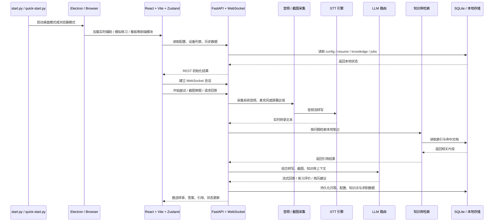

# 智能面试学习辅助助手

实时听题，自动生成专业面试回答。你可以把它理解成一个开着就能用的面试辅助工具：你负责听题和临场反应，它负责转写、答题、截图审题，卡壳的时候还能把问答框挂在旁边。

面向真实技术面试场景：支持系统音频 / 麦克风转写、截图审题、多模型切换、知识库引用；Electron 端提供共享隐身、Boss Key、托盘和轻量悬浮窗，绝大多数常见面试软件场景下都能更稳地避开屏幕共享检测，但具体效果仍建议自行充分实测。

<p align="center">
  
  
  
  
  
  
</p>

https://github.com/user-attachments/assets/1013b772-c59d-4ec4-8256-f932caa8ea3c

<p align="center">
  
  <br />
  <sub>上面是 GitHub 附件视频直链，可在仓库页直接播放；下方保留 GIF 作为静态预览，仓库内原始视频文件仍保留在 <code>docs/screenshots/assist-demo.webm</code>。</sub>
</p>

## 为什么值得试

> 不是“问答玩具”，而是围绕技术面试现场的节奏设计：听题、识别问题、生成答案、必要时引用你自己的笔记，并把共享隐身和悬浮窗能力一起纳入桌面端主流程。

| 场景 | 能力 |
| --- | --- |
| **实时面试** | 系统音频 / 麦克风转写，自动识别问题，多模型并行生成回答 |
| **卡壳补位** | 截图审题、识图模型分析、知识库引用本地笔记 |
| **个人材料接入** | 简历上传、简历优化、知识库引用本地笔记，让答案更贴近你的经历 |
| **桌面端使用体验** | 共享隐身、Boss Key、托盘、轻量悬浮问答框、移动到鼠标附近 |
| **复盘与提升** | 模拟练习、知识点能力分析、求职看板、Offer 对比 |

## 面试主流程

1. 选择系统音频或麦克风，点击开始。
2. 左侧实时转写持续落字，系统自动识别“值得回答”的问题。
3. 右侧答案区按当前模型配置流式生成正式回答。
4. 需要审图时，可粘贴截图，把题目、代码片段或页面内容交给模型分析。
5. 开启知识库后，答案上方会显示引用角标，关联你的本地笔记或资料。
6. 空间紧张时，可用 `⌘⇧J / Ctrl+Shift+J` 折叠左侧实时转录面板，让回答区铺满。
7. 使用桌面模式时，还可以配合共享隐身、Boss Key 和悬浮提示窗一起使用，但不同面试软件策略不同，请务必自行充分实测。

## 主界面速览

<p align="center">
  
</p>

## 关键能力雷达

<table>
  <tr>
    <td width="50%" valign="top">
      <h3>实时辅助</h3>
      <p>ASR 转写、自动识别问题、流式回答、截图审题、知识库引用、模型健康与 Token 统计。</p>
    </td>
    <td width="50%" valign="top">
      <h3>桌面协同</h3>
      <p>Electron 端提供共享隐身、Boss Key、托盘、悬浮问答框和快捷键，尽量减少主界面暴露。</p>
    </td>
  </tr>
  <tr>
    <td width="50%" valign="top">
      <h3>训练与复盘</h3>
      <p>模拟练习、问答记录、能力分析和薄弱点沉淀，方便把“答过的问题”变成“会讲的话题”。</p>
    </td>
    <td width="50%" valign="top">
      <h3>求职材料</h3>
      <p>简历上传与摘要、JD 对照优化、求职看板、Offer 对比，把面试前后动作收在一个工具里。</p>
    </td>
  </tr>
</table>

## 模块画廊

<table>
  <tr>
    <td width="50%"></td>
    <td width="50%"></td>
  </tr>
  <tr>
    <td align="center"><strong>模拟练习</strong><br /><sub>AI 面试官逐题发问、打分、总结</sub></td>
    <td align="center"><strong>能力分析</strong><br /><sub>知识点趋势、问答沉淀、薄弱项复盘</sub></td>
  </tr>
  <tr>
    <td colspan="2"></td>
  </tr>
  <tr>
    <td colspan="2" align="center"><strong>简历优化</strong><br /><sub>把简历和 JD 放到一起，输出更像“能投出去”的版本</sub></td>
  </tr>
</table>

## 功能总览

| 模块 | 现在能做什么 |
| --- | --- |
| **实时辅助** | ASR 转写 → 问题识别 → 多模型回答 → 截图审题 / 知识库引用 |
| **知识库 Beta** | 上传 `.md` / `.txt` / `.log` / `.docx` / `.pdf`，支持检索测试、最近命中和回答引用 |
| **模拟练习** | AI 面试官出题、逐题评价、练习报告 |
| **能力分析** | 知识点标签、历史问答记录、薄弱点趋势 |
| **简历优化** | 上传简历，对照 JD 给出优化建议和改写方向 |
| **求职看板** | 表格 / Kanban、状态标签、拖拽排序、Offer 对比 |
| **设置中心** | 模型管理、STT 引擎、主题、偏好、快捷键、截图区域等配置 |

## 技术结构



### 技术栈

| 层 | 技术 |
| --- | --- |
| **前端** | React 18 · TypeScript · Vite · Zustand · Tailwind CSS · Playwright |
| **后端** | Python 3.10+ · FastAPI · Uvicorn · WebSocket |
| **语音识别** | faster-whisper · 豆包 (Volcengine) · 讯飞 |
| **LLM** | OpenAI 兼容接口 · 多模型并行 · Think 推理 · 识图 |
| **存储** | SQLite · 本地简历历史 · 知识库索引 |
| **桌面** | Electron |

## 快速开始

### 1. 准备环境

- Python `3.10+`
- Node.js `18+`

### 2. 安装依赖

```bash
git clone https://github.com/powAu3/interview-assistant.git
cd interview-assistant

pip install -r backend/requirements.txt

cd frontend
npm install
npm run build
cd ..

cp backend/config.example.json backend/config.json
```

### 3. 配置模型

- 编辑 `backend/config.json`
- 填入你要使用的模型 API Key / Base URL / 模型名
- 如果要启用识图、知识库、豆包语音识别，也在这里一并配置

参考文档：

- [配置说明](docs/配置说明.md)
- [API 密钥与模型](docs/API密钥与模型.md)
- [音频配置](docs/音频配置.md)
- [豆包语音识别](docs/豆包语音识别.md)

### 4. 启动应用

```bash
python start.py                 # 桌面模式（推荐）
python start.py --mode network  # 浏览器模式，默认 http://localhost:18080
```

补充说明：

- 首次启动如果前端尚未构建，`start.py` 会自动安装并构建前端，因此本机仍需要 Node.js。
- `python quick-start.py` 适合已经构建过前端、想快速打开桌面模式的场景。
- 只想在浏览器里体验时，可直接用 `--mode network`。

## 开发与自测

```bash
cd frontend && npm run dev
cd backend && python -m uvicorn main:app --host 127.0.0.1 --port 18080 --reload

cd frontend && npm test
python -m pytest backend/tests -q
```

## README 素材更新

```bash
cd frontend
npx playwright install chromium   # 首次执行需要
npm run screenshots:readme
npm run demo:readme
```

生成结果会输出到 `docs/screenshots/`：

- `assist-demo.webm`：主流程原始视频素材
- `assist-demo-poster.png`：视频封面
- `assist-demo.gif`：README 顶部实际使用的 GIF 演示
- `assist-mode.png`：实时辅助界面
- `practice-mode.png`：模拟练习
- `knowledge-map.png`：能力分析
- `resume-optimizer.png`：简历优化

更多说明见 [docs/screenshots/README.md](docs/screenshots/README.md)。

## 项目结构

```text
interview-assistant/
├── start.py
├── quick-start.py
├── backend/
│   ├── main.py
│   ├── api/
│   ├── core/
│   ├── services/
│   └── tests/
├── frontend/
│   ├── src/
│   ├── scripts/
│   └── package.json
├── desktop/
└── docs/
```

## 常见问题

- **Node / npm 报错**：请确认 Node.js 版本为 `18+`。
- **Electron 下载慢**：可先设置 `ELECTRON_MIRROR=https://npmmirror.com/mirrors/electron/`，再进入 `desktop/` 执行 `npm install`。
- **macOS 下 sounddevice 安装失败**：先执行 `brew install portaudio`。
- **Whisper 模型下载慢**：可设置 `export HF_ENDPOINT=https://hf-mirror.com`。
- **端口冲突**：可改用 `python start.py --port 9090`。

## 开源协议与免责

- **协议**：[CC BY-NC 4.0](https://creativecommons.org/licenses/by-nc/4.0/)
- **免责**：项目仅供学习研究，请勿用于学术不端、违规考试或其他不合规场景；使用后果自行承担。

## 赞赏

若对你有帮助，欢迎请作者喝杯咖啡：

<p align="center">
  
</p>
