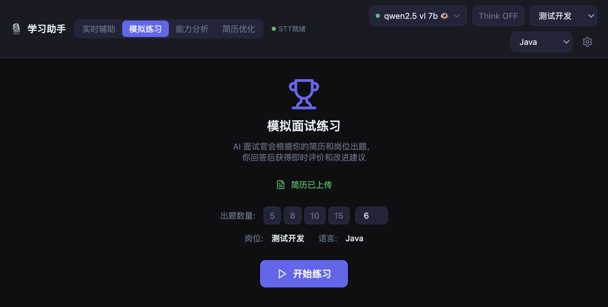
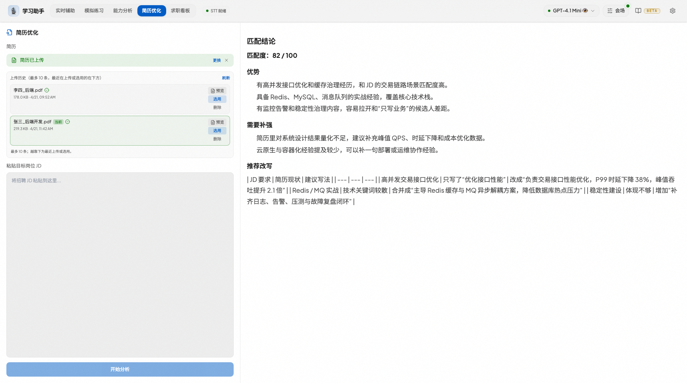

# 智能面试学习辅助助手

实时语音转录 + AI 问答 + 模拟练习 + 简历优化，支持多模型与多技术栈。

<p align="center">
  
  
  
</p>

---

## 界面预览

| 实时辅助 | 模拟练习 | 能力分析 | 简历优化 |
|:---:|:---:|:---:|:---:|
|  |  |  |  |


## 功能概览

- **实时辅助**：系统/麦克风音频 → Whisper 转写 → 自动或手动提问 → 流式答案；支持暂停、清空、取消生成
- **模拟练习**：AI 出题 → 作答 → 即时评分与报告
- **能力分析**：知识图谱与雷达图，薄弱点出题
- **简历优化**：上传 PDF/DOCX/DOC，对比 JD 给匹配度与修改建议
- **多模型**：OpenAI 兼容 API，界面切换；支持 Think、识图；主模型不可用时自动降级
- **桌面/网络**：Electron 窗口（屏幕共享隐身、Boss Key）或浏览器访问（局域网扫码）

---

## 快速开始

**环境**：Python 3.10+、Node.js 18+。推荐使用 pyenv，项目内已包含 `.python-version`。

```bash
git clone https://github.com/powAu3/interview-assistant.git
cd interview-assistant

# 后端依赖（pyenv 下进入目录即切换 Python）
pip install -r backend/requirements.txt

# 前端构建（可选：start.py 会自动构建）
cd frontend && npm install && npm run build && cd ..

# 配置：复制模板并填入 API Key
cp backend/config.example.json backend/config.json
# 编辑 backend/config.json

# 启动
python start.py                    # 桌面模式（Electron）
python start.py --mode network      # 浏览器访问 http://localhost:18080
```

**常用**：`python quick-start.py` 等价于桌面模式且跳过构建。

详细配置见 [docs/配置说明.md](docs/配置说明.md)、[docs/API密钥与模型.md](docs/API密钥与模型.md)；豆包语音与音频配置见 [docs/豆包语音识别.md](docs/豆包语音识别.md)、[docs/音频配置.md](docs/音频配置.md)。

---

## 配置与运行模式

- **配置文件**：`backend/config.json`（从 `config.example.json` 复制）。含模型、STT、岗位/语言、VAD 等。
- **桌面模式**：`python start.py`。Electron 窗口、屏幕共享隐身、Ctrl+B 隐藏、托盘与置顶。
- **网络模式**：`python start.py --mode network`。本机与局域网通过浏览器访问，设置面板底部可扫码。
- **请勿提交**：`config.json`、`.env`、本地临时文件已加入 `.gitignore`，勿提交含密钥内容。

---

## 开发与自测

```bash
# 前端开发（需另起终端跑后端）
cd frontend && npm run dev
cd backend && python -m uvicorn main:app --host 127.0.0.1 --port 18080 --reload

# 端到端自测
python scripts/e2e_test.py
```

---

## 常见问题

- **npm / Node 未找到**：安装 Node.js 18+（如 `nvm install 18`）。
- **Electron 安装慢**：国内可设镜像 `ELECTRON_MIRROR=https://npmmirror.com/mirrors/electron/` 后在 `desktop/` 下 `npm install`。
- **sounddevice 安装失败**：macOS 先 `brew install portaudio`。
- **Whisper 下载慢**：`export HF_ENDPOINT=https://hf-mirror.com`。
- **端口占用**：`python start.py --port 9090` 或结束占用 18080 的进程。

---

## 开源协议与免责

- **协议**：[CC BY-NC 4.0](https://creativecommons.org/licenses/by-nc/4.0/) — 个人与非商业使用可，商业需授权。
- **免责**：仅供学习研究，使用者对使用后果自行负责；不鼓励学术不端或违规使用。

---

## 赞赏

若对你有帮助，欢迎请作者喝杯咖啡：

<p align="center">
  
</p>
