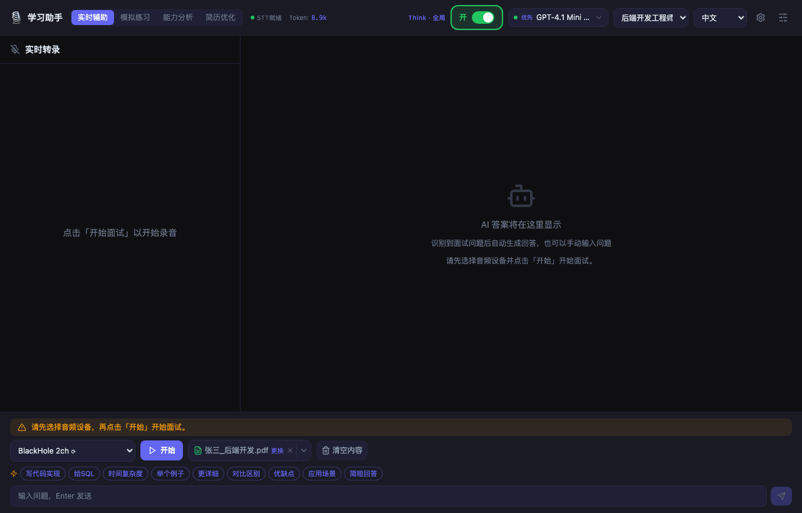
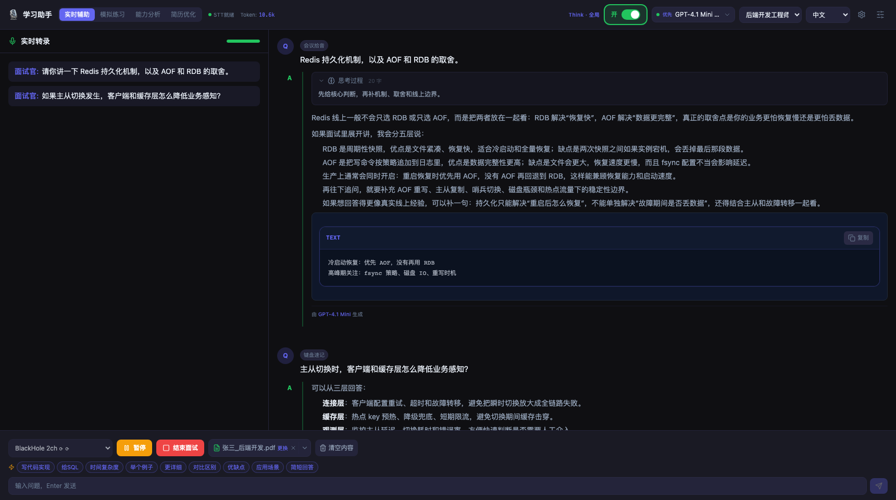

# 智能面试学习辅助助手

实时听题，自动生成专业面试回答。
面向真实技术面试场景：支持系统音频 / 麦克风转写、手动追问、截图审题、多模型切换；Electron 端还提供共享隐身和 Boss Key。



<p align="center">
  
  
  
</p>

## 为什么值得试

- **实时转写**：采集系统音频或麦克风，把面试过程实时转成文字。
- **AI 自动答题**：识别问题后直接生成回答，也可以手动输入追问。
- **截图审题**：支持粘贴截图，把题目、代码或页面内容直接交给模型分析。
- **多模型协同**：支持 OpenAI 兼容接口、优先模型、并行路数、自动降级、Think 与识图。
- **更适合实战**：Electron 端支持共享隐身、`Ctrl/Command + B` Boss Key、托盘和窗口置顶。

## 核心流程

1. 选择系统音频或麦克风。
2. 点击开始，实时转写面试内容。
3. 识别到问题后自动生成回答。
4. 需要时手动追问、补一句“写代码实现”、或直接截图审题。

静态界面预览：



## 其他辅助能力

- **模拟练习**：AI 出题、逐题评价、生成练习报告。
- **能力分析**：沉淀知识点、薄弱点和历史记录。
- **简历优化**：上传简历并对照 JD 给出修改建议。
- **求职看板（仅 Electron）**：本地记录投递进度和 Offer 对比。

## 快速开始

### 1. 准备环境

- Python `3.10+`
- Node.js `18+`

### 2. 安装与配置

```bash
git clone https://github.com/powAu3/interview-assistant.git
cd interview-assistant

pip install -r backend/requirements.txt

cp backend/config.example.json backend/config.json
# 编辑 backend/config.json，填入你的模型 API Key
```

### 3. 启动

```bash
python start.py                 # 桌面模式（Electron）
python start.py --mode network  # 浏览器模式，默认 http://localhost:18080
```

补充说明：

- 首次启动若前端尚未构建，`start.py` 会自动安装前端依赖并构建，所以本机仍需要 Node.js。
- `python quick-start.py` 等价于桌面模式的快捷启动，适合已经构建过前端的情况。

推荐优先使用桌面模式：`python start.py`。
如果只想用浏览器访问，可运行 `python start.py --mode network`。

更多配置见：[配置说明](docs/配置说明.md)、[API 密钥与模型](docs/API密钥与模型.md)、[音频配置](docs/音频配置.md)、[豆包语音识别](docs/豆包语音识别.md)。

## 开发与自测

```bash
cd frontend && npm run dev
cd backend && python -m uvicorn main:app --host 127.0.0.1 --port 18080 --reload

python scripts/e2e_test.py
```

更新 README 截图：

```bash
cd frontend
npx playwright install chromium   # 首次执行需要
npm run screenshots:readme
npm run demo:readme
```

截图和演示 GIF 都会自动输出到 `docs/screenshots/`，详细说明见 [docs/screenshots/README.md](docs/screenshots/README.md)。

## 常见问题

- **Node / npm 报错**：请确认 Node.js 版本为 `18+`。
- **Electron 下载慢**：可先设置 `ELECTRON_MIRROR=https://npmmirror.com/mirrors/electron/` 后再在 `desktop/` 执行 `npm install`。
- **macOS 下 sounddevice 安装失败**：先执行 `brew install portaudio`。
- **Whisper 模型下载慢**：可设置 `export HF_ENDPOINT=https://hf-mirror.com`。
- **端口冲突**：可改为 `python start.py --port 9090`。

## 开源协议与免责

- **协议**：[CC BY-NC 4.0](https://creativecommons.org/licenses/by-nc/4.0/)。
- **免责**：项目仅供学习研究，请勿用于学术不端、违规考试或其他不合规场景；使用后果自行承担。

## 赞赏

若对你有帮助，欢迎请作者喝杯咖啡：

<p align="center">
  
</p>
